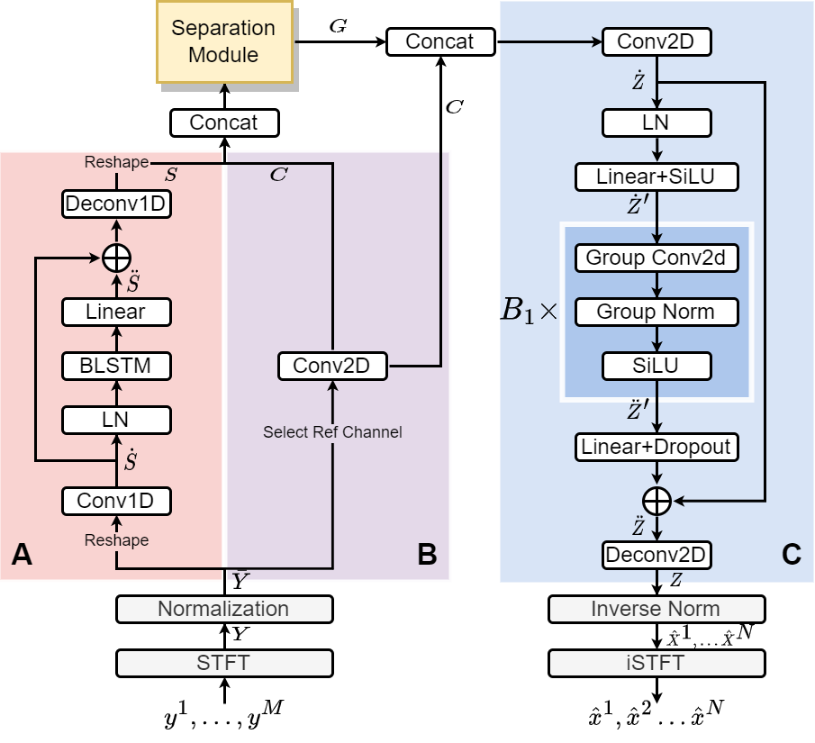

# Time-Frequency Domain Filter-and-Sum Network for Multi-channel Speech Separation

This repository contains the model implementation for the paper titled "Time-Frequency Domain Filter-and-Sum Network for Multi-channel Speech Separation." Our paper proposes a new approach to multi-channel speech separation, building upon the implicit Filter-and-Sum Network (iFaSNet). We achieve this by converting each module of the iFaSNet architecture to perform separation in the time-frequency domain. Our experimental results indicate that our method is superior under the considered conditions.

# Model

We implement the Time-Frequency Domain Filter-and-Sum Network (TF-FaSNet) based on iFaSNet's overall structure. The network performs multi-channel speech separation in the time-frequency domain. Refer to the original paper for more information.

We propose the following improvements to enhance the performance of the iFaSNet model for separating mixtures:

- Use a multi-path separation module for spectral mapping in the T-F domain
- Add a 2D positional encoding to facilitate attention module learning spectro-temporal information
- Use narrow-band feature extraction to exploit inter-channel cues of different speakers
- Add a convolution module at the end of the separation module to capture local interactions and features.

The following flowchart depicts the TF-FaSNet model.

<p align="center">
    
</p>

# Usage

A minimum implementation of the TF-FaSNet model can be found in `model.py`.

## Requirements

- torch==1.13.1
- torchaudio==0.13.1
- positional-encodings==6.0.1

## Dataset

The model is evaluated on a simulated 6-mic circular array dataset. The data generation script is available at [here](https://github.com/yluo42/TAC/tree/master/data).

## Model configurations

To use our model:
``` python
mix_audio = torch.randn(3,6,64000)
test_model = make_TF_FaSNet(
    nmic=6, nspk=2, n_fft=256, embed_dim=16,
    dim_nb=32, dim_ffn=64, n_conv_layers=2, 
    B=4, I=8, J=1, H=128, E=4, L=4
    )
separated_audio = test_model(mix_audio)
```
Each variable stands for:

- General config
    - `nmic`: Number of microphones
    - `nspk`: Number of speakers
    - `n_fft`: Number of FFT points
    - `embed_dim`: Embedding dimension for each T-F unit
- Encoder-decoder:
    - `dim_nb`: Number of hidden units in the Narrow-band feature extraction module
    - `dim_fft`: Number of hidden units between two linear layers in context decoding module
    - `n_conv_layers`: Number of convolution blocks in the context decoding module
- Multi-path separation module:
    - `B`: Number of multi-path blocks
    - `I`: Kernel size for Unfold and Deconv
    - `J`: Stride size for Unfold and Deconv
    - `H`: Number of hidden units in BLSTM
    - `L`: Number of heads in self-attention

With these configurations, we achieve an average 15.5 dB SI-SNR improvement on the simulated 6-mic circular-array dataset with a model size of 2.5M.

# Miscellaneous

Given a $D \times T \times F$ tensor, we apply 2D positional encoding as follows:
$$
PE(t,f,2i) = sin(x/10000^{4i/D}) \\
PE(t,f,2i+1) = cos(x/10000^{4i/D}) \\
PE(t,f,2j+D/2) = sin(y/10000^{4j/D}) \\
PE(t,f,2j+1+D/2) = cos(y/10000^{4j/D})
$$
where $t$ indexes $T$ frames, $f$ indexes $F$ frequencies, and $i,j \in [0, D/4)$ specify the dimension. 